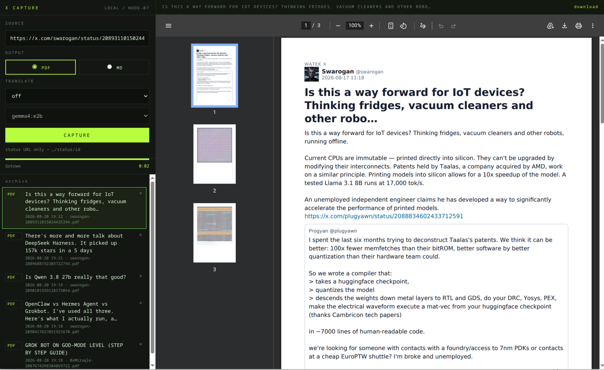

# X Capture

Local converter for X (Twitter) posts and articles to PDF and Markdown.

- threads and X Articles (text, images, captions, video URLs)
- optional translation into any language via Ollama
- archive of generated files with preview



## Requirements

- PHP 8.3+ (`mbstring`, `curl`; `gd` is not required)
- Composer
- optional [Ollama](https://ollama.com) for translation

## Run

```bash
composer install --ignore-platform-req=ext-gd
./start.sh 8081
```

Open http://127.0.0.1:8081

Default translation model: `gemma4:e2b` (change it in the UI or with `OLLAMA_TRANSLATE_MODEL`).

## Tests

```bash
composer test
```
