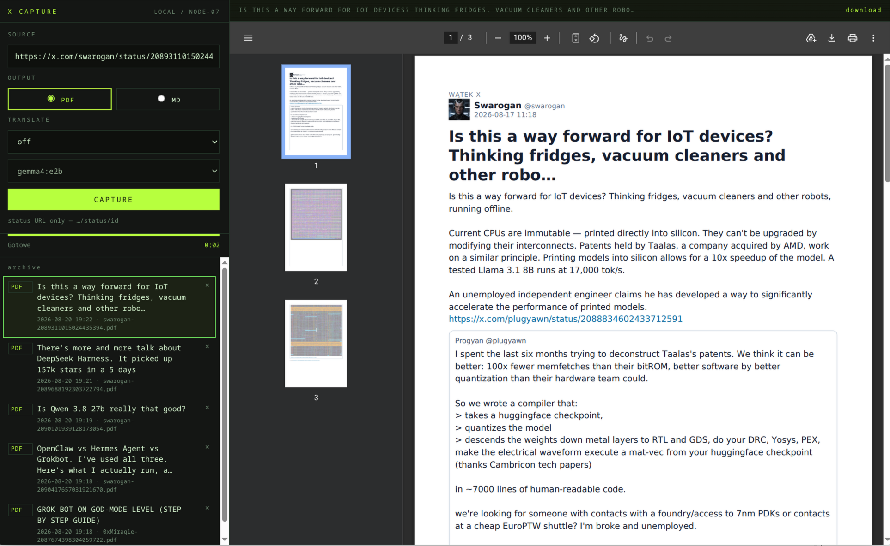

# X Capture

Local converter for X (Twitter) posts and articles to PDF and Markdown.

- threads and X Articles (text, images, captions, video URLs)
- optional translation into any language via Ollama or llama.cpp
- archive of generated files with preview



## Requirements

- PHP 8.3+ (`mbstring`, `curl`; `gd` is not required)
- Composer
- optional [Ollama](https://ollama.com) or [llama.cpp](https://github.com/ggml-org/llama.cpp) (`llama-server`) for translation

## Run

```bash
composer install --ignore-platform-req=ext-gd
./start.sh 8081
```

Open http://127.0.0.1:8081

Default translation model: `gemma4:e2b` (change it in the UI or with `OLLAMA_TRANSLATE_MODEL`).

### Model server

The app probes `127.0.0.1:11434` (Ollama, `/api/*`) and `127.0.0.1:8080` (OpenAI-compatible `/v1/*`, e.g. `llama-server`),
picking whichever answers first. Override with `LLM_HOST` / `OLLAMA_HOST`, or type `ip:port` in the UI field below the
model list — a host given there is the only one probed, so a typo fails loudly instead of silently using a local server.

## Tests

```bash
composer test
```
